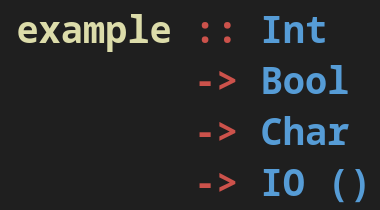

# Pretty HTML

This is just a tiny library enabling [lucid](https://hackage.haskell.org/package/lucid) to be used as a backend for [prettyprinter](https://hackage.haskell.org/package/prettyprinter). This makes it easy to programmatically generate HTML documents with complex nested styling.

# Example

This code, adapted from `prettyprinter`'s main example, produces the following:



```hs
{- cabal:
build-depends: base, text, lucid, prettyprinter, prettyprinter-lucid
-}
{-# LANGUAGE GHC2021 #-}
{-# LANGUAGE OverloadedStrings #-}
{-# OPTIONS_GHC -Wall #-}

module Main (main) where

import Data.Text (Text)
import Lucid
import Lucid.Base
import Prettyprinter
import Prettyprinter.Lucid
import Prettyprinter.Render.Util.SimpleDocTree (treeForm)

main :: IO ()
main = renderToFile "example.html" $ render 20 doc

render :: Int -> Doc (Html () -> Html ()) -> Html ()
render width' =
    div_ [style "background-color: #1F1F1F; padding: 0.2rem; padding-left: 0.4rem"]
        . renderHtml
        . treeForm
        . layoutPretty
            defaultLayoutOptions{layoutPageWidth = AvailablePerLine width' 1}

doc :: Doc (Html () -> Html ())
doc =
    annotate (span_ [style "font-weight: bold"]) $
        prettyprintDeclaration
            "example"
            ["Int", "Bool", "Char", "IO ()"]
  where
    prettyprintDeclaration n tys =
        colour "#DCDCAB" (pretty @Text n) <+> prettyprintType tys
    prettyprintType =
        align
            . sep
            . zipWith (<+>) (map (colour "#CC524B") $ "::" : repeat "->")
            . map (colour "569CD6")
    colour c =
        annotate (span_ [style $ "color: " <> c])

style :: Text -> Attribute
style = makeAttribute "style"
```
